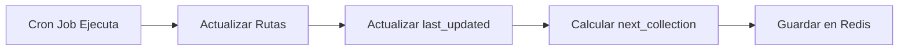

# 📅 Sistema de Horarios de Recolección

Sistema para gestionar y visualizar los horarios de recolección automática mediante cron jobs.

## 🎯 Estructura de Datos

Los horarios se almacenan en **Redis** con la siguiente estructura:

```json
{
  "cron_schedule": "0 16 * * *",
  "next_collection": "2025-11-10T16:00:00Z",
  "last_updated": "2025-11-09T10:30:00Z",
  "description": "Diario a las 16:00 (4 PM)"
}
```

### Campos:

- **cron_schedule**: Expresión cron que define cuándo se ejecuta (`"minuto hora día mes día_semana"`)
- **next_collection**: Fecha y hora calculada de la próxima recolección planificada
- **last_updated**: Última vez que se ejecutó el cron o se actualizó manualmente
- **description**: Descripción legible del horario (generada automáticamente)

---

## 📡 Endpoints

### 1. **Obtener Configuración Actual**

```http
GET /schedule
```

**Response (200 OK):**
```json
{
  "cron_schedule": "0 16 * * *",
  "next_collection": "2025-11-10T16:00:00Z",
  "last_updated": "2025-11-09T10:30:00Z",
  "description": "Diario a las 16:00 (4 PM)"
}
```

**Ejemplo con curl:**
```bash
curl http://localhost:8080/schedule
```

---

### 2. **Actualizar Horario del Cron**

```http
PUT /schedule
```

**Request Body:**
```json
{
  "cron_schedule": "0 */6 * * *"
}
```

**Response (200 OK):**
```json
{
  "message": "Configuración de horario actualizada exitosamente",
  "config": {
    "cron_schedule": "0 */6 * * *",
    "next_collection": "2025-11-09T18:00:00Z",
    "last_updated": "2025-11-09T12:00:00Z",
    "description": "Cada 6 horas"
  },
  "note": "Recuerda actualizar tu cron job en Render o donde esté configurado"
}
```

**Ejemplo con curl:**
```bash
curl -X PUT http://localhost:8080/schedule \
  -H "Content-Type: application/json" \
  -d '{"cron_schedule": "0 */6 * * *"}'
```

---

## 🕐 Formatos de Cron Válidos

| Expresión Cron | Descripción | Ejemplo de Uso |
|---|---|---|
| `0 16 * * *` | Todos los días a las 16:00 (4 PM) | Recolección diaria por la tarde |
| `0 */6 * * *` | Cada 6 horas | Recolección frecuente |
| `0 8 * * 1-5` | Lunes a Viernes a las 8 AM | Solo días laborables |
| `*/30 * * * *` | Cada 30 minutos | Testing o alta frecuencia |
| `0 0 * * *` | Todos los días a medianoche | Recolección nocturna |
| `0 4 * * *` | Todos los días a las 4 AM | Recolección madrugada |

### Formato Cron:
```
┌───────────── minuto (0 - 59)
│ ┌───────────── hora (0 - 23)
│ │ ┌───────────── día del mes (1 - 31)
│ │ │ ┌───────────── mes (1 - 12)
│ │ │ │ ┌───────────── día de la semana (0 - 6) (Domingo=0)
│ │ │ │ │
│ │ │ │ │
* * * * *
```

### Caracteres especiales:
- `*` : Cualquier valor
- `*/N` : Cada N unidades
- `1-5` : Rango de valores (1 a 5)
- `1,3,5` : Lista de valores específicos

---

## 🔄 Flujo Automático

### Cuando se ejecuta el Cron Job:

1. El endpoint `POST /cron/update-routes` se ejecuta
2. Se calculan y actualizan todas las rutas
3. **Automáticamente** se actualiza `last_updated` en Redis
4. Se calcula la `next_collection` basada en el `cron_schedule`



---

## 🎨 Casos de Uso

### **Caso 1: Consultar cuándo fue la última recolección**

```bash
curl http://localhost:8080/schedule | jq '.last_updated'
# Output: "2025-11-09T10:30:00Z"
```

### **Caso 2: Consultar cuándo será la próxima recolección**

```bash
curl http://localhost:8080/schedule | jq '.next_collection'
# Output: "2025-11-10T16:00:00Z"
```

### **Caso 3: Cambiar horario del cron a cada 4 horas**

```bash
curl -X PUT http://localhost:8080/schedule \
  -H "Content-Type: application/json" \
  -d '{"cron_schedule": "0 */4 * * *"}'
```

**⚠️ Importante:** Después de cambiar el `cron_schedule` en la aplicación, debes actualizar el cron job real en Render/crontab.

### **Caso 4: Cambiar a horario laboral (Lunes-Viernes, 9 AM)**

```bash
curl -X PUT http://localhost:8080/schedule \
  -H "Content-Type: application/json" \
  -d '{"cron_schedule": "0 9 * * 1-5"}'
```

---

## 📱 Integración con Frontend

### Mostrar próxima recolección en UI:

```javascript
fetch('http://api.example.com/schedule')
  .then(res => res.json())
  .then(data => {
    console.log('Próxima recolección:', data.next_collection);
    console.log('Última actualización:', data.last_updated);
    console.log('Descripción:', data.description);
  });
```

### Actualizar horario desde panel admin:

```javascript
const updateSchedule = async (newCron) => {
  const response = await fetch('http://api.example.com/schedule', {
    method: 'PUT',
    headers: { 'Content-Type': 'application/json' },
    body: JSON.stringify({ cron_schedule: newCron })
  });
  
  const result = await response.json();
  console.log(result.message);
  alert(result.note); // Recordar actualizar cron real
};

// Ejemplo: cambiar a cada 6 horas
updateSchedule('0 */6 * * *');
```

---

## 🛠️ Configuración en Render

Cuando actualices el `cron_schedule` mediante la API, recuerda actualizar el cron job en Render:

1. Ve a tu proyecto en Render
2. Navega a "Cron Jobs"
3. Edita el schedule del cron job
4. Guarda los cambios

**Ejemplo:**
- Si cambias a `"0 */6 * * *"` en la API
- Actualiza en Render el schedule a: `0 */6 * * *`

---

## 🧪 Testing

### Probar actualización manual:

```bash
# 1. Ver configuración actual
curl http://localhost:8080/schedule

# 2. Cambiar a cada hora
curl -X PUT http://localhost:8080/schedule \
  -H "Content-Type: application/json" \
  -d '{"cron_schedule": "0 * * * *"}'

# 3. Verificar cambios
curl http://localhost:8080/schedule

# 4. Ejecutar cron manualmente
curl -X POST http://localhost:8080/cron/update-routes \
  -H "Authorization: YOUR_CRON_API_KEY"

# 5. Ver que last_updated se actualizó
curl http://localhost:8080/schedule | jq '.last_updated'
```

---

## 📊 Valores por Defecto

Si no existe configuración en Redis, se crea automáticamente con:

```json
{
  "cron_schedule": "0 16 * * *",
  "next_collection": "[calculado para las 16:00 del próximo día]",
  "last_updated": "[timestamp actual]",
  "description": "Diario a las 16:00 (4 PM)"
}
```

---

## ⚠️ Notas Importantes

1. **Sincronización Manual**: El campo `cron_schedule` en Redis es **informativo**. Debes actualizar el cron job real manualmente.

2. **Zona Horaria**: Los timestamps usan la zona horaria del servidor. Asegúrate de que esté configurada correctamente.

3. **Validación**: La API valida que el formato cron tenga 5 campos, pero no valida todos los rangos posibles.

4. **Actualización Automática**: El campo `last_updated` se actualiza automáticamente cuando se ejecuta el cron exitosamente.

---

## 🚀 Ejemplos Completos

### Ejemplo 1: Recolección diaria a las 4 PM

```bash
curl -X PUT http://localhost:8080/schedule \
  -H "Content-Type: application/json" \
  -d '{"cron_schedule": "0 16 * * *"}'
```

### Ejemplo 2: Recolección cada 4 horas

```bash
curl -X PUT http://localhost:8080/schedule \
  -H "Content-Type: application/json" \
  -d '{"cron_schedule": "0 */4 * * *"}'
```

### Ejemplo 3: Recolección solo fines de semana a las 10 AM

```bash
curl -X PUT http://localhost:8080/schedule \
  -H "Content-Type: application/json" \
  -d '{"cron_schedule": "0 10 * * 0,6"}'
```

---

## 📚 Referencias

- [Crontab Guru](https://crontab.guru/) - Herramienta para entender expresiones cron
- [Render Cron Jobs](https://render.com/docs/cronjobs)
- [Cron Format Guide](https://en.wikipedia.org/wiki/Cron)
